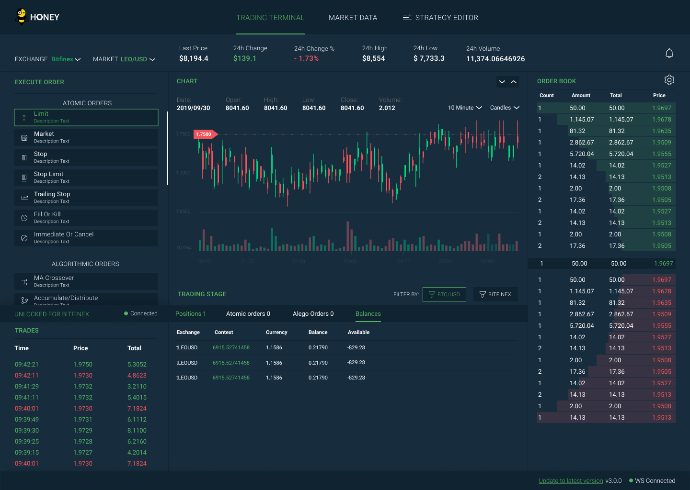

### IMPORTANT NOTICE
As [announced](https://www.bitfinex.com/posts/1072/), on November 6, 2024 Bitfinex Honey will no longer support the 'dead-man switch' or 'DMS' feature. This will apply to all versions of Bitfinex Honey. Your version of Bitfinex Honey will be affected. 
This change will mean that the orders you created using any version of Bitfinex Honey will continue running even if you turn off the machine running Bitfinex Honey. Previously, the DMS feature would have stopped those orders when you disconnected. If you do not want those orders to continue, you can close open orders before you disconnect Bitfinex Honey, or close them manually by logging into Bitfinex. 
Please plan accordingly for this change.

# Bitfinex Honey UI

- Creates HF services as background processes
- Enables order types (Accum/Dist, Ping/Pong, Iceberg, TWAP and OCOCO)
- Define and backtest trading strategies

## Installation

Steps to install

```bash
git clone https://github.com/bitfinexcom/bfx-hf-ui
cd bfx-hf-ui
npm run fetch-core
npm install
```

Create folder to store local db

```
mkdir ~/.bitfinexhoney
touch ~/.bitfinexhoney/algos.json
touch ~/.bitfinexhoney/hf-bitfinex.json
touch ~/.bitfinexhoney/ui.json
touch ~/.bitfinexhoney/strategy-executions.json
```

## Run Electron version in the browser

```bash
npm run start-ds-bitfinex
npm run start-api-server
npm run build-css
npm run start
```

## Fetch latest submodule

```bash
npm run update-core
```

## Build Electron app manually

Generates an installable application to run independently from the browser. Once you have ran the below command navigate to the `/dist` folder and select the instillation executable file for the operating system that you are using.

```bash
npm run build
npm run dist-win-unpruned # for windows
npm run dist-mac # for mac
npm run dist-linux # for linux
```

## Install pre-built Electron app

Head to the latest cut [releases](https://github.com/bitfinexcom/bfx-hf-ui/releases) and locate the most recent release. Once there you will see installers attached for `linux`, `mac` and `windows`. Run the installer for the operating system that you are using.

## The UI

Starting the Bitfinex Honey UI will spawn all of the Bitfinex Honey services that are needed to register custom algo-order definitions in the background. Currently (as of release 1.0.0) the UI will register the built in default order types which will be instantly available for use in the bitfinex.com UI. For more info on how to use algo orders once the UI is running head [here](https://medium.com/bitfinex/announcing-the-honey-framework-algorithmic-orders-8065fb70c65c).



## API Key Permissions

To login to the HF application, please use API keys generated from bitfinex platform. Minimum required API key permissions are as following:

- Get orders and statuses.
- Create and cancel orders.
- Get wallet balances and addresses.


## Contributing

1. Fork it (https://github.com/bitfinexcom/bfx-hf-ui)
2. Create your feature branch (`git checkout -b my-new-feature)
3. Commit your changes (`git commit -am 'Add some feature'`)
4. Push to the branch (`git push origin my-new-feature`)
5. Create a new Pull Request
