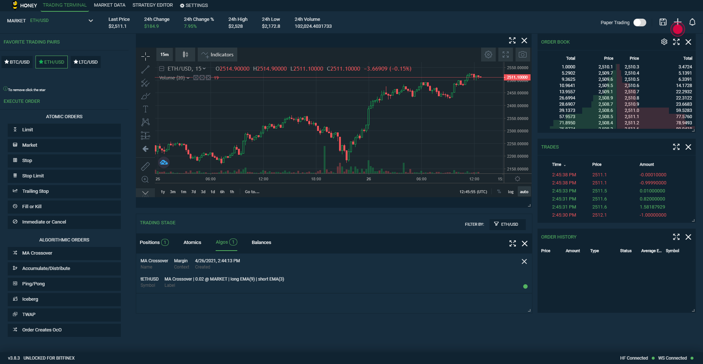

# Honey Framework UI
* Creates HF services as background processes
* Enables order types (Ping/Pong, Iceberg, TWAP and Accum/Dist)
* Create customer order types (coming soon)

## Installation

```bash
git clone https://github.com/bitfinexcom/bfx-hf-ui
npm install --dev
```

## Run in the browser

```
npm run build
npm run start-server
npm start
```

## Build electron app manually

Generates an installable application to run independently from the browser. Once you have ran the below command navigate to the `/dist` folder and select the instillation executable file for the operating system that you are using.
```bash
npm run pack
npm run dist
```

## Install pre-built electron app

Head to the latest cut [releases](https://github.com/bitfinexcom/bfx-hf-ui/releases) and locate the most recent release. Once there you will see installers attached for `linux`, `mac` and `windows`. Run the installer for the operating system that you are using.

## The UI

Starting the HF UI will spawn all of the Honey Framework services that are needed to register custom algo-order definitions in the background. Currently (as of release 1.0.0) the UI will register the built in default order types which will be instantly available for use in the bitfinex.com UI. For more info on how to use algo orders once the UI is running head [here](https://medium.com/bitfinex/announcing-the-honey-framework-algorithmic-orders-8065fb70c65c).



## Up and coming features

* Ability to code your own definitions from within the UI
* Real-time info updates on executing orders
* Ability to Enable/Disable order definitions

## Contributing

1. Fork it (https://github.com/bitfinexcom/bitfinex-api-go)
2. Create your feature branch (`git checkout -b my-new-feature)
3. Commit your changes (`git commit -am 'Add some feature'`)
4. Push to the branch (`git push origin my-new-feature`)
5. Create a new Pull Request
